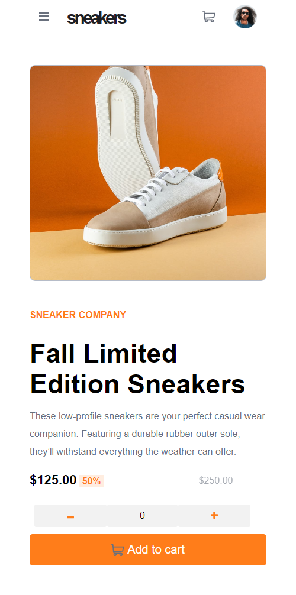
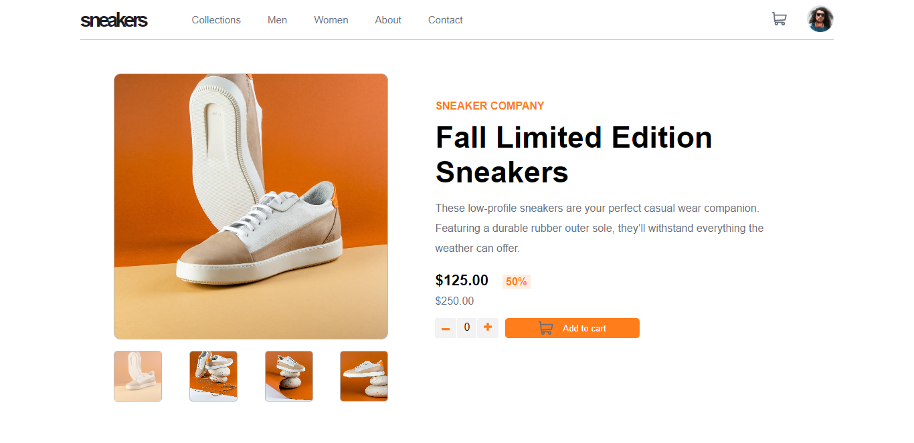

# Frontend Mentor - E-commerce product page solution

This is a solution to the [E-commerce product page challenge on Frontend Mentor](https://www.frontendmentor.io/challenges/ecommerce-product-page-UPsZ9MJp6). Frontend Mentor challenges help you improve your coding skills by building realistic projects.

## Table of contents

- [Overview](#overview)
  - [Screenshot](#screenshot)
  - [Links](#links)
  - [Built with](#built-with)

### Screenshot

### Links

- Solution URL: [Add solution URL here](https://your-solution-url.com)

### Built with

- Semantic HTML5 markup
- CSS custom properties
- Flexbox

- Website - [Add your name here](https://www.your-site.com)
- Frontend Mentor - [@itsTari](https://www.frontendmentor.io/profile/itsTari)
- Twitter - [@sheis-Glory](https://www.twitter.com/sheis-Glory)

